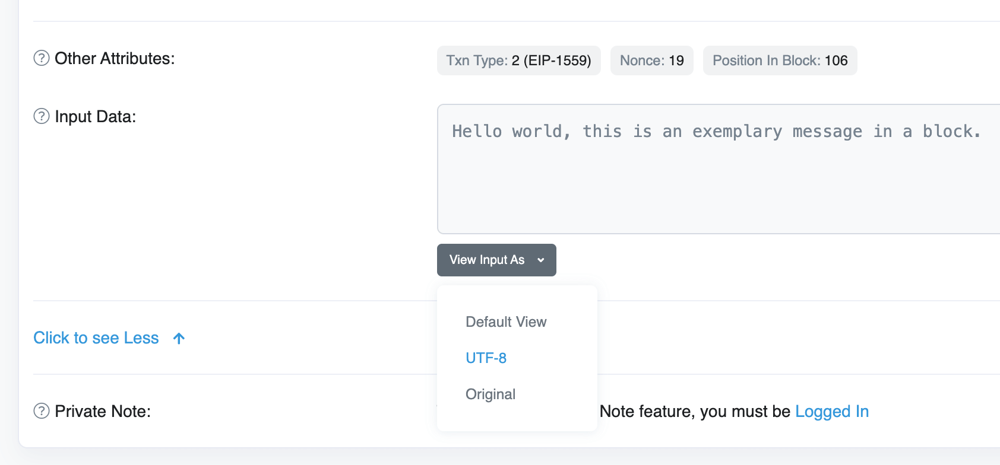

# Message in a Block

> Send messages in a bottle, but on the blockchain.

»Message in a Block« allows you to send permanent (and uncensorable) messages such as proofs or love letters as transaction input data on the blockchain instead of carving them into a park bench, tree, or toilet wall. You can send the message to yourself (e.g. for the sake of persisting it on the blockchain) or to any wallet address (e.g. to send them an unforgettable message).

## Why?

The original idea and plan for this project was to create a tiny game on the blockchain where I wanted to reboot [a very old idea/project of mine](https://web.archive.org/web/20120218024955/http://flaschenpo.st): a service where you can send any message to a random person. You don’t know who this person is as they’re chosen randomly. That person is on the list of recipients because they already sent a message in a bottle on their own. Basically you’d send a random message to the person before you and would become the next recipient for a random message of the person after you.

When getting started with it, I thought it may be even more fun to create messages on the blockchain in general, not only within that service/contract.

## How?

When sending or receiving money on the blockchain, all relevant details are publicly accessible and forgery-proof. Less attention, however, is paid to the fact that blockchains can also store custom messages which become permanent and uncensorable due to the nature of blockchains.

For example, Ethereum allows to attach extra custom the form of hexadecimal characters to transactions. Once decoded, this can be regular text, ASCII art, a number—basically anything. »Message in a Block« creates transactions with an amount of 0 and using the data part to get your message onto the blockchain. You only have to pay the gas fee for the transaction itself.

[The Ethers project](https://www.npmjs.com/package/ethers) is doing most of the hard work under the hood.

## Example

`0xde4b636683d5970c0d00b30d76bca801484f8f3db6a878145459ef23be1445f8` is an exemplary message in a block. You can view the transaction either on [Message in a Block](https://message-in-a-block.com/tx/0xde4b636683d5970c0d00b30d76bca801484f8f3db6a878145459ef23be1445f8) itself or [Etherscan](https://etherscan.io/tx/0xde4b636683d5970c0d00b30d76bca801484f8f3db6a878145459ef23be1445f8) where you can view the tansaction’s input data as UTF-8.



## Future

This project may be extended one day to come back to the original idea of having a »message in a bottle« game on the blockchain. Or it could be used to implement some kind of »pay to contact me«-like service by utilizing ENS address aliases and providing vanity URLs such as `message-in-a-block.com/to/rasshofer.eth`. Let’s see.

## Code of Conduct

People are people and most likely someone will abuse this service to send insults to other people or persist inappropriate content on the blockchain, unfortunately. Please don’t be an asshole. Anything you persist on the blockchain is irreversible once stored. It interferes with any right to be forgotten. So: be kind/careful and use this service only for good and useful things.

## Installation

1. Make sure you’re up and running with Node.js v18+ (e.g. by using [nvm](https://github.com/nvm-sh/nvm) and running `nvm use`)
2. Clone this repository
3. Run `npm ci`
4. Copy `.env.example` to `.env` and fill in the respective values

## Usage

### Build UI statically for deployment

```sh
npm run build
```

Next, you need to deploy the built files to your environment/server/container.

### Run application in dev mode (incl. hot-reloading)

```sh
npm start
```

Head over to <http://localhost:3000/>.

### Deploy

```sh
npm run deploy
```
